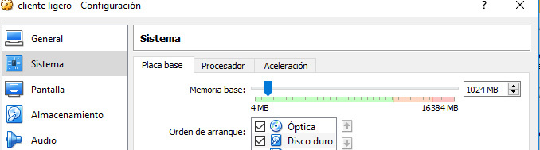

# LTSP CLIENTES LIGEROS

## Raul suarez noda

## Configuración de la red del servidor.

### *Configuración de las redes.*
**Primero debemos crear la maquina virtual y añadirle dos interfaces de red, una en modo puente y otra en modo red interna, para ello vamos a los ajustes y procedemos a añadir las interfaces.**
### *Red Normal*

**Le asignamos estas caracteristicas**
* Direccion IP
* Una mascara de red
* Puerta de enlace
* Servidor DNS
* Nombre de dominio

### *Red Interna*

**Añadimos una nueva interfaz de red interna en la maquina virtual y la Configuramos tal que asi.**

**Le asignamos estas caracteristicas**
* Direccion IP
* Mascara de red
* Puerta de enlace

## *Configuración de archivos Hosts y Hostname*

Accedemos al fichero **etc/hosts** y modificamos la linea donde aparece nuestro usuario, junto a el añadimos el nombre del dominio añadiendo .curso1819 y tambien añadimos nuestro nombre de nuevo.

Accedemos al fichero **etc/hostname** y modificamos el nombre del host añadiendo el nombre del dominio .curso1819.

## *Comprobacion de comandos*
* Route-n
* Hostname -a
* Hostname -f
* Uname -a

* IP a
* Blkid

## *Creación de usuarios*

creamos 3 nuevos usuarios en el sistema.

## *Instalacion del servicio Openssh-server*

Para instalar el servicio **Openssh-server** ejecutamos el comando con privilegios de root; *sudo  apt-get install openssh-server*
una vez comience la instalacion nos aparece una opción para poder continuar debemos poner **s**.

## *Modificación del fichero SSH*
Accedemos al fichero **sshd_config** y cambiamos el apartado authentication; permit root login a **yes**

## *Instalación del servicio LTSP*
Ejecutamos el comando con permisos de root; *sudo apt-get install ltsp-server-standalone*

## *Creación de imagen*
creamos la imagen del sistema

# **Configuración del CLIENTE**

creamos la maquina sin disco duro  ni disco de imagen.

Le añadimos memoria ram que es uno de los dos requisitos para hacer el cliente ligero.

Le añadimos una interfaz de red Interna

Le activamos el soporte 3D y le subimos la memoria grafia a 128Mb

