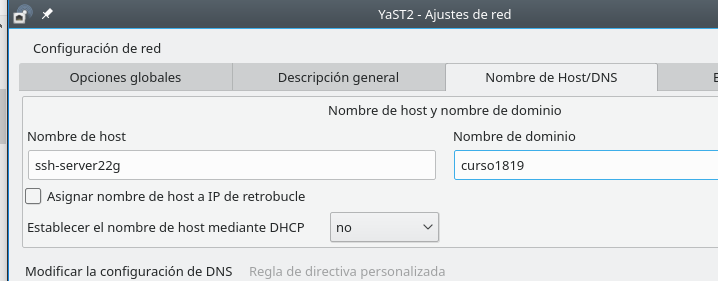
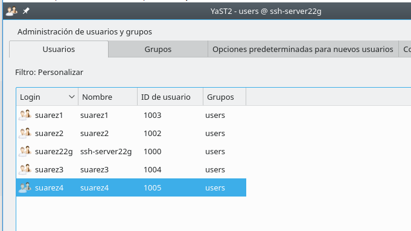
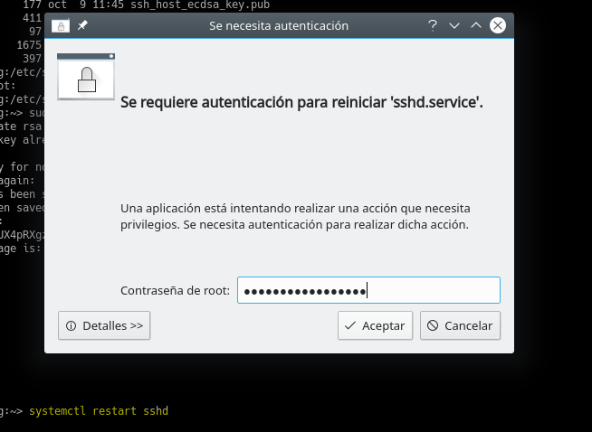
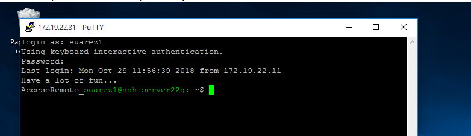
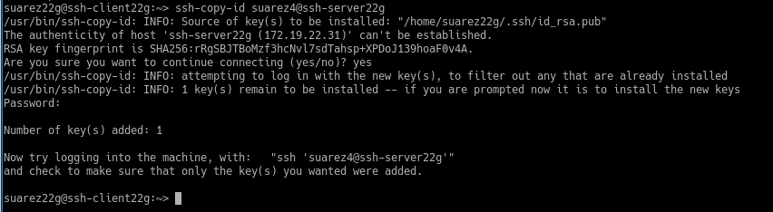
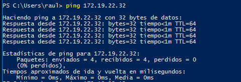

# Acceso remoto SSH

## 1 Servidor SSH

Configuramos el servidor, cambiando el nombre del equipo por *ssh-server22g*, la ip y creamos una clave compleja del usuario root.

Añadimos en */etc/hosts* los equipos clientes *ssh-client22g* y *ssh-client22w*.

Comprobamos los cambios ejecutando estos comandos:
* ip a; Comprobar IP, máscara y ver nombre del interfaz de red.
* ip route; Comprobar puerta de enlace.
* ping 8.8.4.4 -i 2; Comprobar conectividad externa.
* host www.nba.com; Comprobar el servidor DNS.

Comprobamos los cambios ejecutando estos comandos:
* ping ssh-client22g; Comprobar conectividad con cliente GNU/Linux.
* ping ssh-client22w; Comprobar conectividad con cliente Windows.
* lsblk; Consultar particiones.
* blkid; Consultar UUID de la instalación.

Creamos los siguientes usuarios en ssh-server22g:

## 1.2 Cliente GNU/Linux.

Configuramos el cliente1, cambiando el nombre del equipo por *ssh-client22g* y la ip.

Añadimos en /etc/hosts los equipos *ssh-server22g* y *ssh-client22w*.

## 1.3 Cliente Windows.

Configuramos el cliente cambiando el nombre del equipo a *ssh-client22w*, la ip y la puerta de enlace.

Añadimos en C:\Windows\System32\drivers\etc\hosts el equipo *ssh-server22g* y *ssh-client22g*.

Comprobamos haciendo ping a ambos equipos.

Instalar software cliente SSH PuTTy en Windows.

# Instalación del servicio SSH.

Instalar el servicio SSH en la máquina *ssh-server22g*, desde la terminal con *zypper install openssh*, ejecutamos el comando pero ya tenemos instalado el paquete *OpenSSh*.

## 2.1 Comprobamos el estado del servicio.

Ejecutamos el comando systemctl status sshd.

Ejecutamos ps -ef|grep sshd para comprobarlo en  los procesos del sistema.

sudo lsof -i:22 -n para comprobar que el servicio está escuchando por el puerto 22.

## 2.2 Primera conexión SSH desde cliente GNU/Linux.

Desde el cliente *ssh-client22g* hacemos un *ping* y *nmap -Pn ssh-server22g* al servidor para comprobar la conexión.

Desde el cliente GNU/Linux nos conectamos mediante ssh *suarez1@ssh-server22g*.

Comprobamos el intercambio de claves que se produce en el primer proceso de conexión SSH.

Volvemos a conectarnos y solo nos mostrará esto.

Comprobamos el contenido del fichero *$HOME/.ssh/known_hosts* en el equipo *ssh-client22g*.

## 2.3 Primera conexión SSH desde cliente Windows.

Nos conectamos usando *PuTTY*, ponemos la ip del servidor *ssh-server22g*, no usaremos *Save Settings* para guardar la configuración de la conexión.

Nos muestra el intercambio de claves que se produce en el primer intento de conexión y en la ventana *PuTTy Security Alert* seleccionamos **SI** a grabar la información del servidor.

Conexión realizada correctamente.

## 3 ¿Y si cambiamos las claves del servidor?

Confirmamos que existen los ficheros **ssh_host*key** y **ssh_host*key.pub** en la ruta */etc/ssh*.

Modificamos el fichero de configuración SSH *(/etc/ssh/sshd_config)* para dejar una única línea: **HostKey /etc/ssh/ssh_host_rsa_key**, comentamos el resto de líneas con configuración HostKey, con este cambio decimos que sólo vamos a usar las claves del tipo RSA.

### 3.1 Regenerar los certificados

En el servidor *ssh-server22g*, como usuario root ejecutamos: **ssh-keygen -t rsa -f /etc/ssh/ssh_host_rsa_key** y no ponemos ninguna contraseña al certificado.

Reiniciamos el servicio ssh con el comando *systemctl restart sshd*, nos pide la autenticación.

Comprobamos que el servicio está en ejecución con el comando *systemctl status sshd*.

### 3.2 Comprobación

Accedemos desde el cliente *ssh-client22g* usando el usuario *suarez1*.

Accedemos desde el cliente *ssh-client22w* usando el usuario *suarez1*, nos dice que se ha generado una nueva clave rsa.

## 4 Personalización del prompt Bash

Añadimos las siguientes lineas al fichero *.bashrc* en la ruta */home/suarez1/.bashrc*.

Creamos el fichero */home/suarez1/.alias*, donde pondremos el siguiente contenido:

Comprobamos el funcionamiento de la conexión SSH desde cada cliente.

Accedemos desde el cliente *ssh-client22g*

Accedemos desde el cliente *ssh-client22w*

## 5 Autenticación mediante claves públicas

Vamos a la máquina ssh-client22g y ejecutamos el comando *ssh-keygen -t rsa* para generar un nuevo par de claves para el usuario en */home/nombre-alumno/.ssh/id_rsa y
/home/nombre-alumno/.ssh/id_rsa.pub*.

Ahora copiamos la clave pública *id_rsa.pub* al fichero *authorized_keys* del usuario suarez1, usaremos el comando *ssh-copy-id*

Comprobamos que accede desde el ssh-client22g y no pide contraseña.

Comprobamos que accede desde el ssh-client22w y si pide contraseña.

## 6 Uso de SSH como túnel para X

Instalamos en el servidor una aplicación de entorno gráfico *Geany*  que no esté en los clientes.

Ahora modificamos el servidor SSH para permitir la ejecución de aplicaciones gráficas, desde los clientes, para ello debemos consultar fichero de configuración */etc/ssh/sshd_config*  y poner la opción *X11Forwarding*  en **yes** y descomentarla.

Ahora nos vamos al *ssh-client22g* y ejecutamos el comando *zypper se geany* para comprobar que no esta instalado.

Ahora comprobamos en el cliente que *geany* funciona de forma remota desde el servidor, conectamos con el comando *ssh -X suarez1@ssh-serverXXg* y ejecutamos *geany*.

## 7 Aplicaciones Windows nativas

Instalamos el emulador *Wine* en el *ssh-server22g*

Usando el Block de notas de *Wine*, notepad comprobamos el funcionamiento en el server22g.

Usando el Block de notas de *Wine*, notepad comprobamos el funcionamiento en el client22g.

## 8 Restricciones de uso

### Restricción sobre un usuario

Modificaremos los usuarios del servidor ssh para añadir una restricción al usuario *suarez2* para que nos deniege el permiso de acceso, para ello debemos acceder al fichero de configuración */etc/ssh/sshd_config* y añadimos la linea *DenyUsers* y el usuario al que queremos denegar el acceso.

Comprobamos la restricción.

### Restricción sobre una aplicación

Vamos a crear una restricción de permisos sobre determinadas aplicaciones, para ello creamos el grupo **remoteapps** e incluimos al usuario *suarez4* en el grupo.

Localizamos la ruta donde se encuentra el programa *Geany* y le ponemos al grupo *remoteapps* como propietario y le ponemos los permisos a *750* para que los ususarios que no pertenezcan al grupo no puedan ejecutar el programa.

Comprobamos el funcionamiento en el servidor con el usuario *suarez1*.

Comprobamos el funcionamiento en el cliente con el usuario *suarez1*.

Comprobamos el funcionamiento en el servidor con el usuario **suarez4**.

## 9 Servidor SSH en Windows

Configuramos el servidor y le cambiamos el nombre del equipo a *ssh-server22s*

Añadimos en C:\Windows\System32\drivers\etc\hosts el equipo ssh-client22g y ssh-client22w.

Comprobamos haciendo ping a ambos equipos.

Instalamos el servidor SSH, descargamos el zip de OpenSSH y lo descomprimimos en la ruta C:archivosdeprograma\OpenSSH.

Iniciamos PowerShell como Administrador y nos movemos hasta C:\Program files\OpenSSH y ejecutamos el script para instalar los servicios *sshd* y *ssh-agent*.
* Set-ExecutionPolicy –ExecutionPolicy Bypass
* .\install-sshd.ps1

Generamos las claves (certificados) del servidor.

Habilitamos la regla de nombre SSH en el Firewall de Windows para permitir (Allow) conexiones TCP entrantes (Inbound) en el puerto 22 (SSH):
* *New-NetFirewallRule -Protocol TCP -LocalPort 22 -Direction Inbound -Action Allow -DisplayName SSH*

Comprobamos el acceso SSh desde los clientes.

* netstat - n para Windows.

* lsof -i -n para Linux.

