# Acceso remoto VNC

# 1. Instalación en Windows.

Configurarmos las máquinas virtuales según lo indicado en el documento.

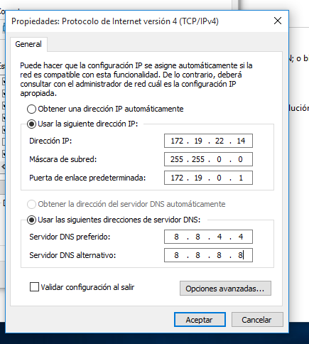

Cambio de nombre de equipo y unión al grupo de trabajo.

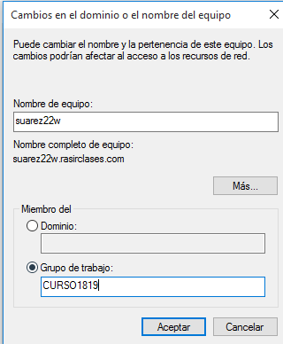

Confirmación de unión al grupo de trabajo.

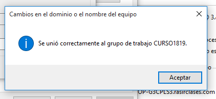

### 1.1 VNC en Windows.

En el servidor VNC instalamos TightVNC Server.

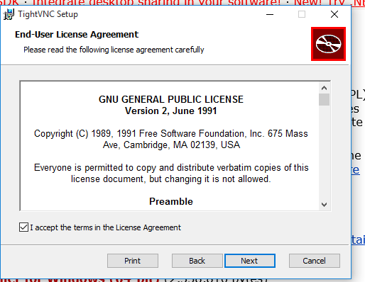

Configurarmos la instalación.
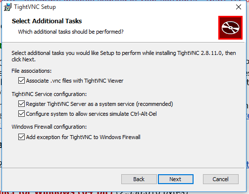

Avanzamos en el proceso de instalación e instalamos.

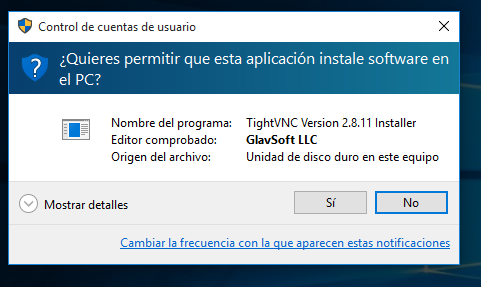

Continuado este paso nos pide la clave y finaliza la instalación.

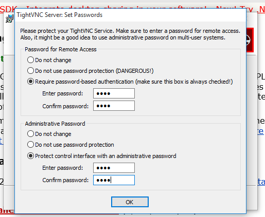

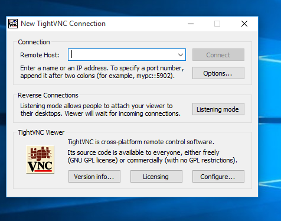

Comprobamos que está funcionando el servicio.

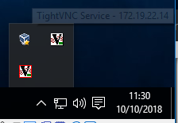

## 1.2 Ir una máquina GNU/Linux
Ejecutar nmap -Pn IP-VNC-SERVER, desde la máquina real GNU/Linux para comprobar que los servicios son visibles desde fuera de la máquina VNC-SERVER.
Deben verse los puertos 5801, 5901, etc.

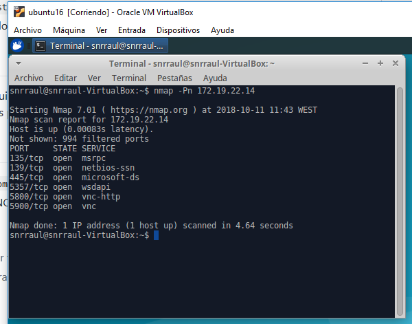

## 1.3 Cliente Windows

Configurarmos el cliente.

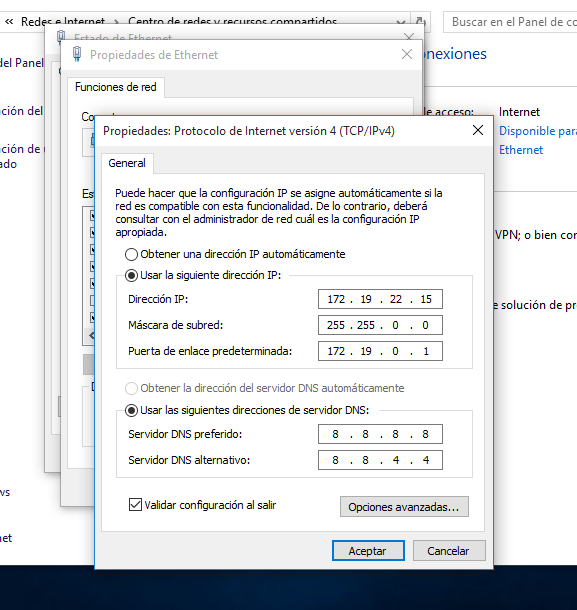

Instalamos TightVNC Viewer.

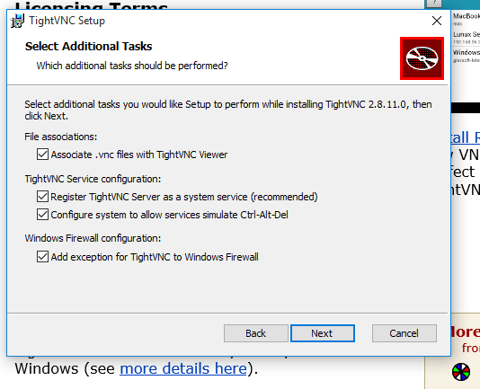

Nos pide una acreditación y establecemos la contraseña.

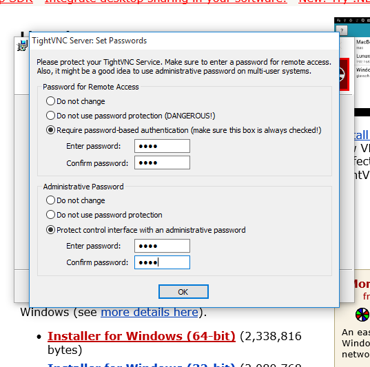

Desactivamos el cortafuegos.

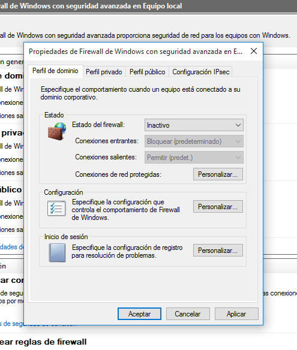

# 1.4 Conectamos desde el cliente al servidor.

Añadimos la IP del servidor.

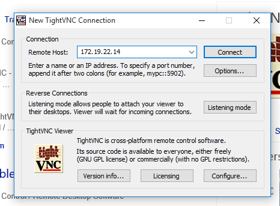

Al conectar nos pide la contraseña anteriormente configurada.

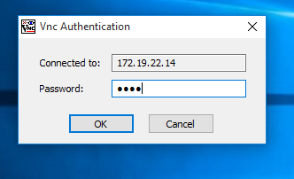

Conexión establecida y comprobamos que funciona.

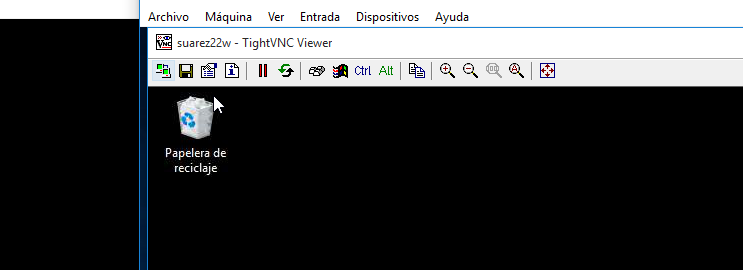

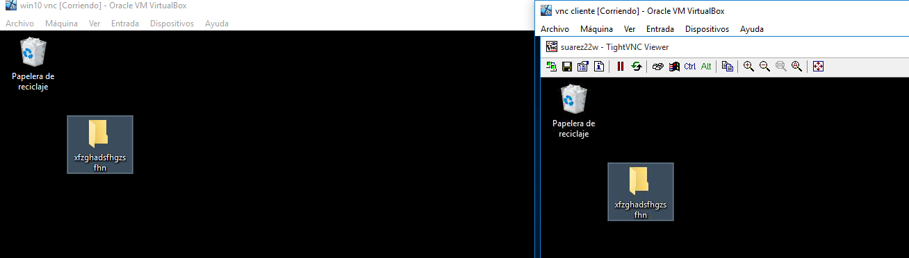

## 1.5 Comprobaciones finales.
Para verificar que se han establecido las conexiones remotas:

En el servidor VNC usar el comando netstat -n para ver las conexiones VNC con el cliente.

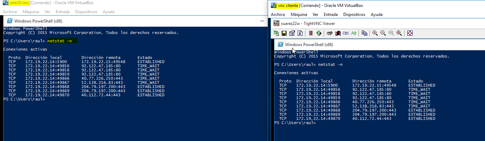

# 2. Instalación en OpenSUSE.

Configurarmos las máquinas virtuales según lo indicado en el documento.
## 2.1 Servidor OpenSUSE

Configuramos la ip del servidor y el nombre de host.

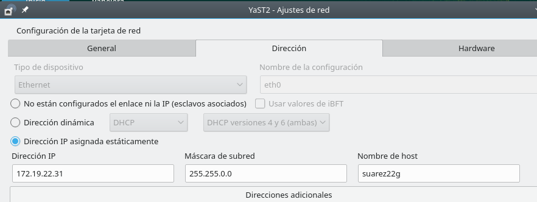

Añadimos el dominio y la puerta de enlace.

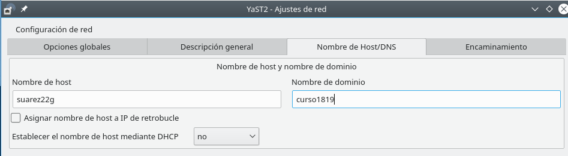

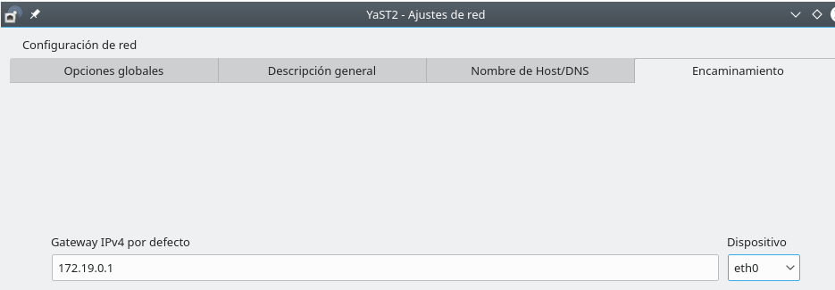

Vamos a  Yast -> VNC y permitimos la conexión remota y abrimos el cortafuegos.

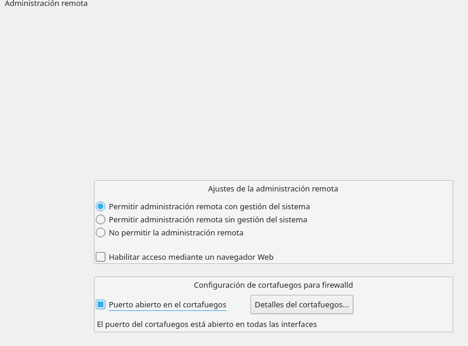

Vamos a  Yast  -> Cortafuegos y revisamos la configuración del cortafuegos, permitimos las conexiones a vnc-server.

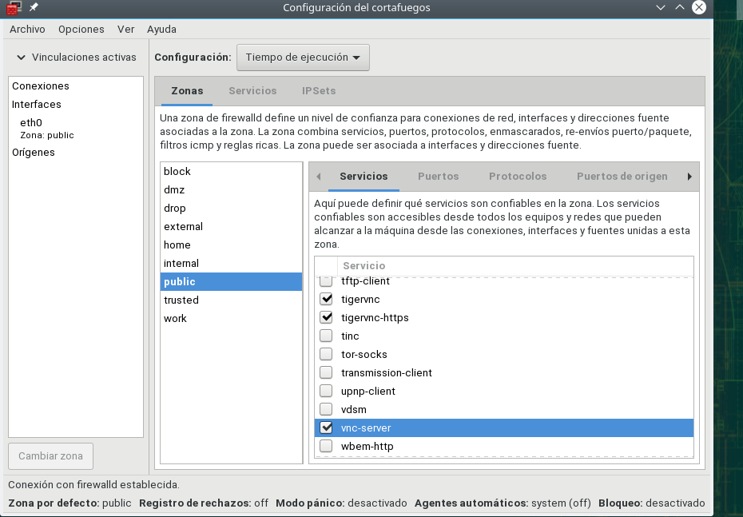

Instalamos el paquete VNC.

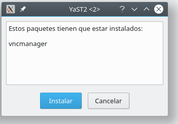

Ejecutamos vncserver en el servidor para iniciar el servicio VNC y ponemos la clave para las conexiones vnc al escritorio.
Al final nos muestra el numero de escritio remoto.

Ejecutamos ps -ef|grep vnc para comprobar que los servicios relacionados con vnc están en ejecución.

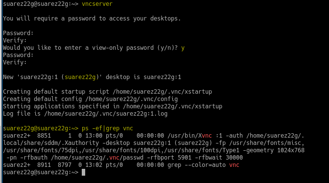

Ejecutamos lsof -i -n para comprobar que están los servicios en los puertos VNC (580X y 590X).

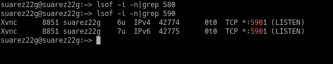

## 2.2 Ir a una máquina GNU/Linux
Ejecutar nmap -Pn IP-VNC-SERVER, para comprobar que los servicios son visibles desde fuera de la máquina VNC-SERVER. Deben verse los puertos VNC (5801, 5901, etc).

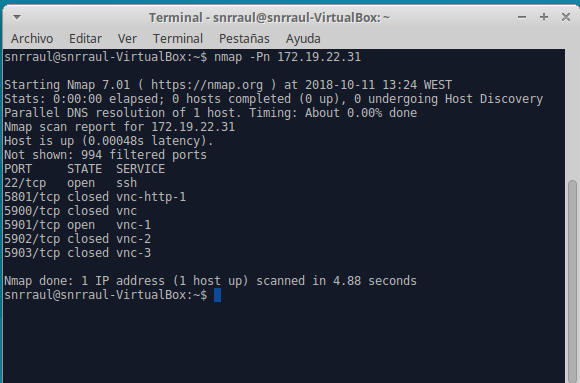

## 2.3 Cliente GNU/Linux.
vncviewer es un cliente VNC que viene con OpenSUSE.

Configurarmos las máquinas virtuales según lo indicado en el documento.

Configuramos la ip del servidor y el nombre de host.

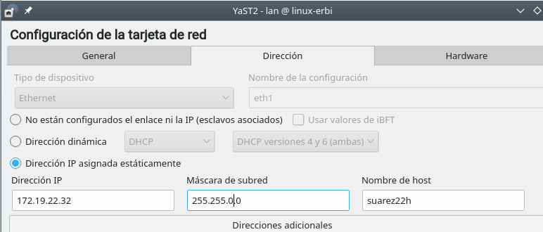

Añadimos el dominio y la puerta de enlace.

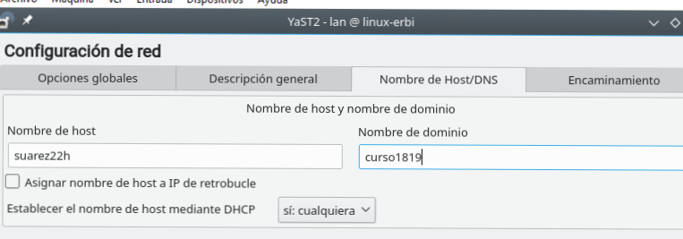

Vamos a  Yast  -> Cortafuegos y revisamos la configuración del cortafuegos, permitimos las conexiones a vnc-server.

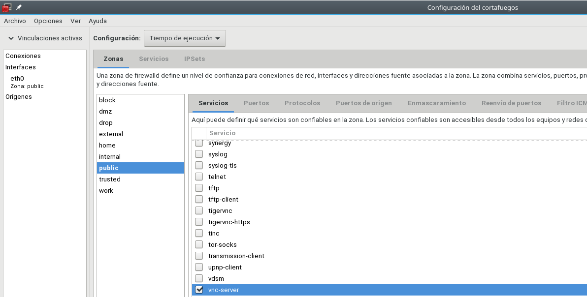

Intento de conexion por el puerto 5901, pero aparecia la pantalla en negro, comprobramos que todos los puertos están disponibles y tras intentar acceder por todos el resultado era el mismo.

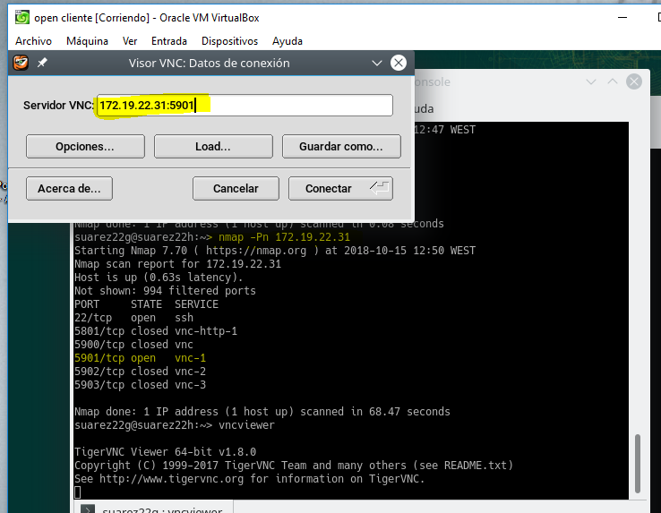

Ponemos la clave.

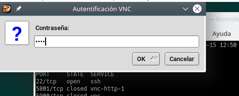

Conexión establecida y comprobación de los puertos mediante el comando lsof -i -n|grep 590, los puertos están bien y a la escucha, pero aún asi se mostraban las pantallas en negro.

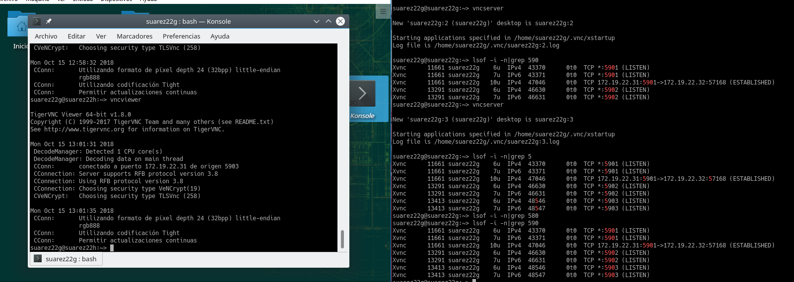

La solución fue conectar por el puerto 5900 y ejecutar este comando **x0vncserver -display :0 -passwordfile /home/nombre-alumno/.vnc/passwd**  que se encuentra en el **paso 4**.

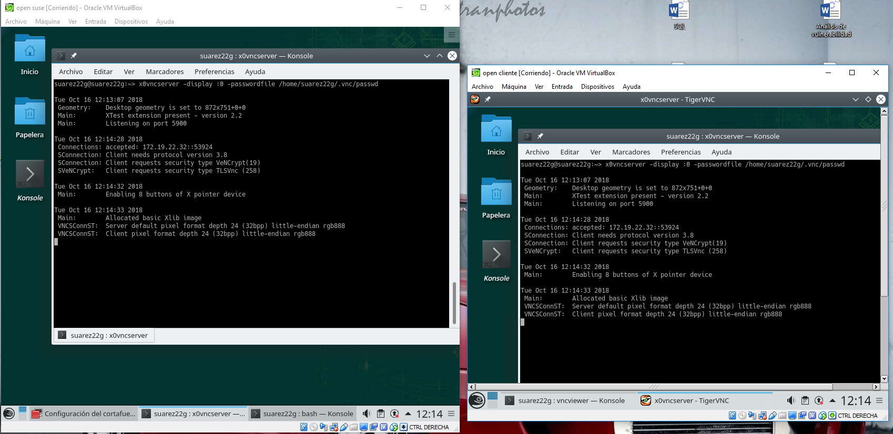

## 2.4 Comprobaciones finales.
Comprobaciones para verificar que se han establecido las conexiones remotas:

Ejecutamos **lsof -i -n** en el servidor para comprobar las conexiones VNC.
Ejecutar **vncserver -list** en el servidor.

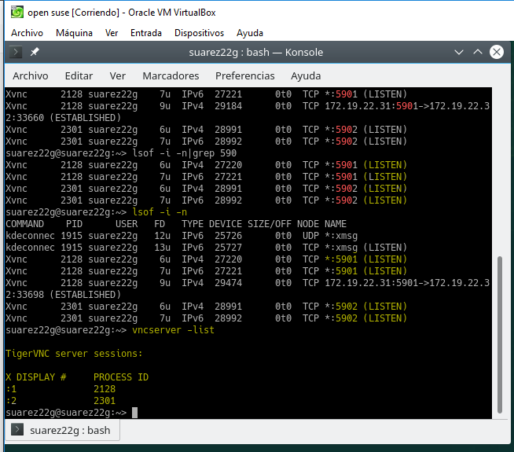

## 3. Comprobaciones con SSOO cruzados

#### Conectamos el cliente GNU/Linux con el Servidor VNC Windows.

Establecemos la conexión desde el cliente de OpenSUSE al servidor Windows, para ello ejecutamos vncviewer y ponemos la IP del servidor.

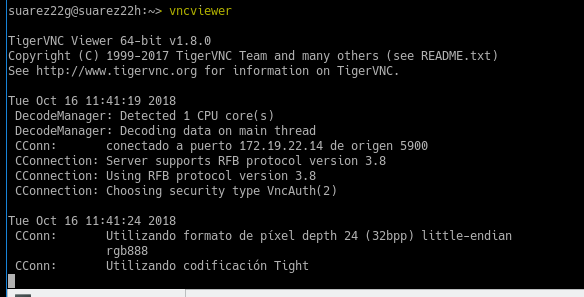

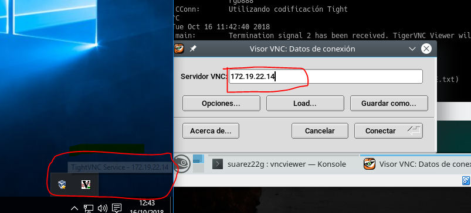

Conexión establecida, cree una carpeta para comprobar que se mostraban los cambios.

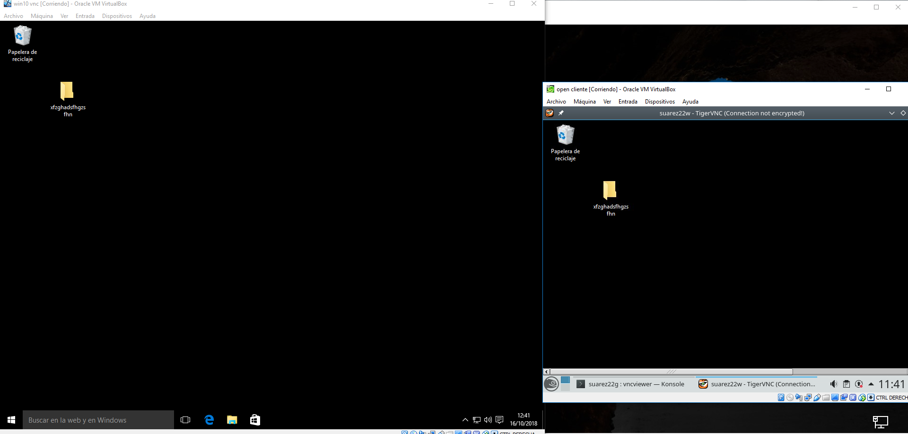

Ejecutamos netstat en el servidor.

#### Conectamos el cliente Windows con el servidor VNC GNU/Linux.

Establecemos la conexión desde el cliente de Windows al servidor OpenSUSE, para ello ejecutamos vncviewer y ponemos la IP del servidor.

Ejecutamos el comando del paso 4 **x0vncserver -display :0 -passwordfile /home/nombre-alumno/.vnc/passwd** y conectamos por el puerto 5900.

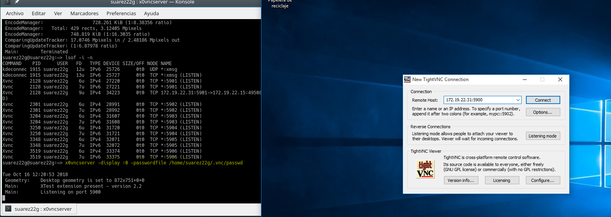

Establecemos conexión poniendo la contraseña.

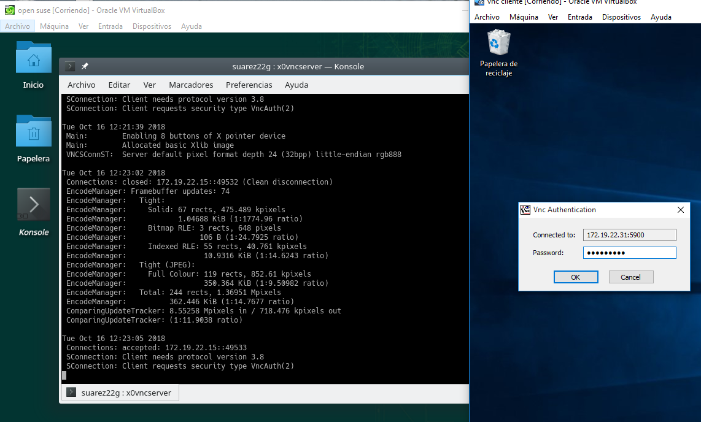

Funcionó correctamente.

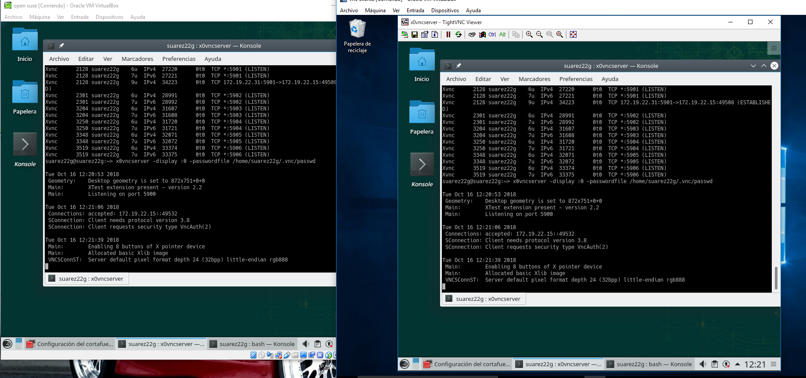

Ejecutar en el servidor GNU/Linux lsof -i.

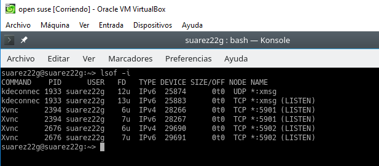

# 4. DISPLAY 0 en GNU/Linux

Cuando queremos ejecutar vncserver para controlar directamente la pantalla local usaremos x0vncserver de tigervnc.

En el servidor ejecutamos:
**x0vncserver -display :0 -passwordfile /home/nombre-alumno/.vnc/passwd**

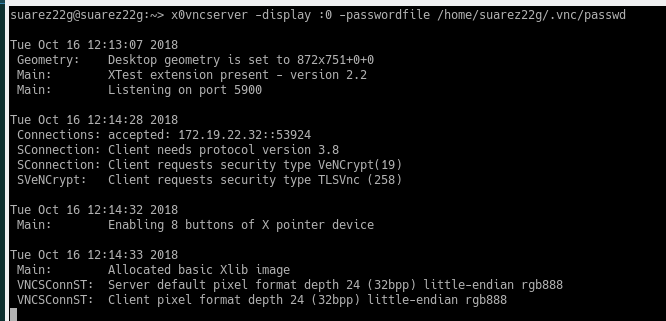

lsof -i -n

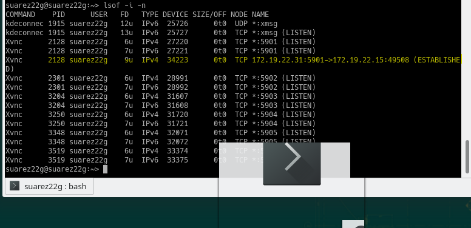

Vamos al cliente y probamos a conectarnos con el servidor.

