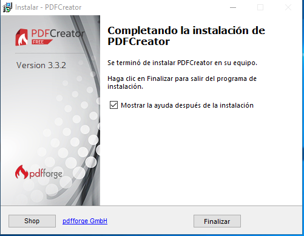
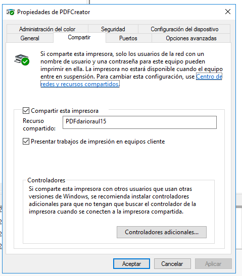
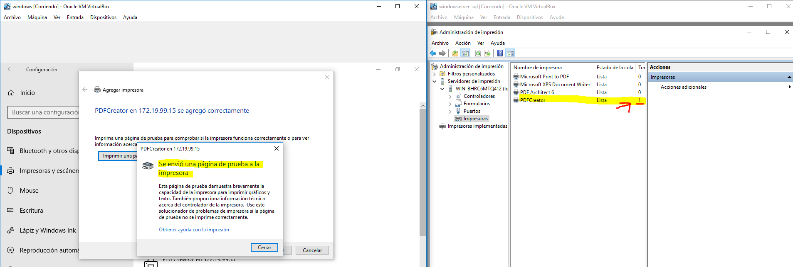
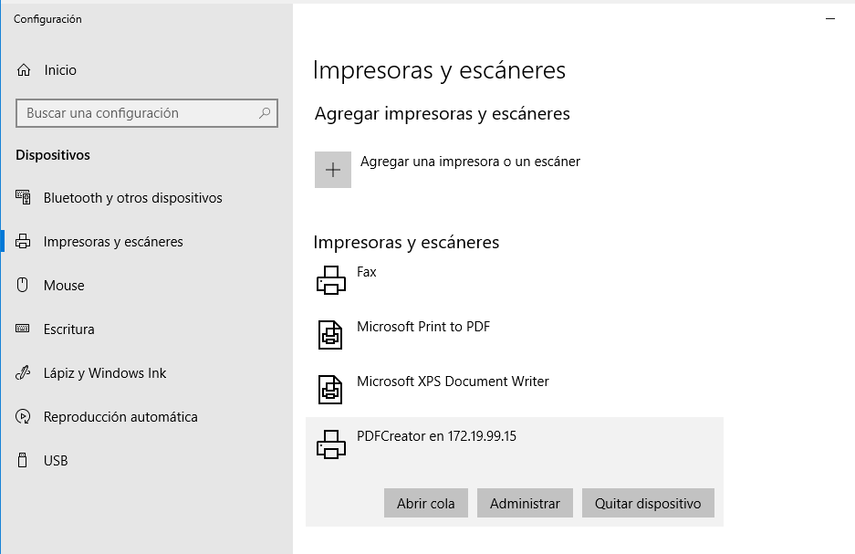

# Servidor de Impresión en Windows

# Grupo: Raúl Suárez Noda & Darío Díaz Farrais.

## 1. Impresora compartida
### 1.1 Rol impresión

    Vamos al servidor, instalar rol/función de servidor de impresión.
    Incluir impresión por Internet.(La Incluimos en el punto 2)

Seleccionamos los servicios de  impresión y documentos.

Agregamos la característica de servidor de impresión.

Completamos la instalación.

### 1.2 Instalar impresora PDF

Vamos a conectar e instalar localmente una impresora al servidor Windows Server, de modo que estén disponibles para ser accedidas por los clientes del dominio.
Vamos a instalar un programa que simule una impresora de PDF.

    Descargamos PDFCreator (URL recomendada www.pdfforge.org/pdfcreator/download) e instalar.

Accedemos a la URL y descargamos el ejecutable.

Lo ejecutamos

Comenzamos la instalación.

Instalación completada.

    Ejecutamos PDFCreator y configuramos en perfiles -> Guardar -> Automático. Ahí configuramos carpeta destino impresora.

### 1.3 Probar la impresora en local

    Para probar la nueva impresora abrimos el Bloc de notas y creamos un fichero luego seleccionamos imprimir.

Al imprimir se abre PDFCreator.

    Cuando finalice el proceso se abrirá un fichero PDF con el resultado de la impresión.

### 1.4 Compartir por red

**Vamos a la MV del servidor.**

    Ir al Administrador de Impresión -> Impresoras
    Elegir impresora PDFCreator.
        Botón derecho -> Propiedades -> Compartir
        Como nombre del recurso compartido utilizar PDFnombrealumnoXX.

**Vamos al cliente:**

    Buscar recursos de red del servidor. Si tarda en aparecer ponemos \\ip-del-servidor en la barra de navegación.
    Seleccionar impresora -> botón derecho -> conectar.
        Ponemos usuario/clave del Windows Server.

    Ya tenemos la impresora remota configurada en el cliente.
    Probar la impresora remota.ç

Imprimimos una página de prueba.

Comprobamos en el servidor que llega a la impresora.

## 2. Acceso Web

Realizaremos una configuración para habilitar el acceso web a las impresoras del dominio.
### 2.1 Instalar característica impresión WEB

    Vamos al servidor.
    Nos aseguramos de tener instalado el servicio "Impresión de Internet".

### 2.1 Configurar impresión WEB

Vamos a la MV cliente:

    Abrimos un navegador Web.
    Ponemos URL http://<ip-del-servidor>/printers (o http://<nombre-del-servidor>/printers), previa autenticación como uno de los usuarios del habilitados para dicho fin (por ejemplo el "Administrador").

    Pincha en la opción propiedades y captura lo que se ve.

    Agregar impresora (NO es local)

    Crear nueva impresora usando el URL anterior.

### 2.2 Comprobar desde el navegador

Realizamos seguidamente una prueba sencilla en tu impresora de red:

        Acceder a la configuración de la impresora a través del navegador.

            Poner en pausa los trabajos de impresión de la impresora.

        Ir a MV cliente.
        Envía a imprimir en tu impresora compartida un documento del Bloc de notas.
            Comprobar que al estar la impresora en pausa, el trabajo aparece en cola de impresión.

        Finalmente pulsa en reanudar el trabajo para que tu documento se convierta a PDF.

