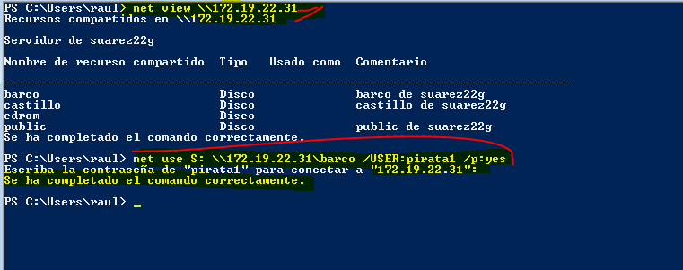

# Samba (con OpenSUSE y Windows)

## 1. Servidor Samba.

### 1.1 Preparativos
Configuramos el servidor GNU/Linux;
Nombre de equipo: smb-server22g.
Añadir en /etc/hosts los equipos smb-clig22g y smb-cli22w.

Ejecutamos los comandos siguientes en el servidor:

* hostname -f
* ip a
* lsblk
* sudo blkid

### 1.2 Usuarios locales

Vamos a GNU/Linux, y creamos los siguientes grupos y usuarios:

Crear los grupos piratas, soldados y todos.

Crear el usuario smbguest.

* Dentro del grupo piratas incluir a los usuarios pirata1, pirata2 y supersamba.
* Dentro del grupo soldados incluir a los usuarios soldado1 y soldado2 y supersamba.
* Dentro del grupo todos, poner a todos los usuarios soldados, pitatas, supersamba y a smbguest.

* Poner a los usuarios de samba dentro del grupo cdrom.

### 1.3 Crear las carpetas para los futuros recursos compartidos

Creamos las carpetas dentro del directorio srv/samba22.

Le damos los permisos y configuramos el grupo propietario de cada carpeta y que el usuario propietario de todas sea supersamba.

**Actualizamos los permisos por una modificación del informe**

### 1.4 Configurar el servidor Samba **CAPTURA AL GRUPO NUEVA**

Hacemos una copia de seguridad del fichero de configuración existente cp /etc/samba/smb.conf /etc/samba/smb.conf.000.

Vamos a Yast -> *Samba Server*, configuramos el Workgroup: *curso1819* (puse mar1718 porque así lo ponía la practica antes de modificar todo.), lo queremos sin controlador de dominio.

En la pestaña de Inicio definimos, Iniciar el servicio durante el arranque de la máquina.
Ajustes del cortafuegos -> Abrir puertos.

### 1.5 Crear los recursos compartidos de Samba

Configuramos los recursos compartidos del servidor Samba.

Vamos al fichero de configuración **smb.conf**, configuramos las secciones global, cdrom, public, barco, y castillo como la siguiente:

Abrimos una consola para comprobar los resultados.
* cat /etc/samba/smb.conf

* testparm

### 1.6 Usuarios Samba

Añadimos los usuarios a Samba, **smbpasswd -a nombreusuario** , para crear clave Samba para todos los usuarios que van a user SMB/CIFS.

pdbedit -L, para comprobar la lista de usuarios Samba.

### 1.7 Reiniciar

Recargamos los ficheros de configuración del servicio.

* Servicio smb systemctl reload smb

* Servicio nmb systemctl reload nmb

Ejecutamos los siguientes comando de comprobación:
* sudo testparm para verificar la sintaxis del fichero de configuración del servidor Samba.

* sudo lsof -i para comprobar que el servicio SMB/CIF está a la escucha.

### 2. Windows

Configuramos el cliente Windows, usamos el nombre y la IP que hemos establecido al comienzo.

Configuramos el fichero ...\etc\hosts de Windows.

### 2.1 Cliente Windows GUI

Desde el cliente Windows accedemos a los recursos compartidos del servidor Samba.

Ponemos ()\\ip-del-servidor-samba) en este caso \\172.19.22.31 y vemos que conecta y muestra los recursos.

Accedemos al recurso compartido con el usuario invitado.
* **net use para ver** las conexiones abiertas.

* **net use * /d /y** para borrar todas las conexión SMB/CIFS que se han realizado.

Accedemos al recurso compartido con el usuario soldado.

* **net use** para ver las conexiones abiertas.
* **net use * /d /y** para borrar todas las conexión SMB/CIFS que se hadn realizado.

Accedemos al recurso compartido con el usuario pirata.

**Vamos al servidor Samba.**

* smbstatus, desde el servidor Samba.
* lsof -i, desde el servidor Samba.

### 2.2 Cliente Windows comandos

**Abrimos una shell de windows.**
* net use /?, para consultar la ayuda del comando.
* net use, para consultar todas las conexiones/recursos conectados hacemos .

Si hubiera alguna conexión abierta la cerramos y **net use** para comprobar que no hay conexiones establecidas.

**net view (\\IP-SERVIDOR-SAMBA) \\172.19.22.31**, para ver los recursos de esta máquina.

**net use S: (\\IP-SERVIDOR-SAMBA)\\172.19.22.31\recurso clave /USER:usuario /p:yes** crear una conexión con el recurso compartido y lo monta en la unidad S.
Probamos a montar el recurso barco.

* net use, para comprobar.

Ahora podríamos entrar en la unidad S ("s:") y crear carpetas, etc.

Comprobamos los resultados de estos comandos.
* smbstatus, desde el servidor Samba.

* lsof -i, desde el servidor Samba.

## 3 Cliente GNU/Linux

Configurar el cliente GNU/Linux.
Usar nombre y la IP que hemos establecido al comienzo.
Configurar el fichero /etc/hosts de la máquina.

### 3.1 Cliente GNU/Linux GUI

Accedemos al recurso del servidor Samba, pulsamos CTRL+L y escribimos (smb://IP-SERVIDOR-SAMBA) **smb://172.19.22.31**:

