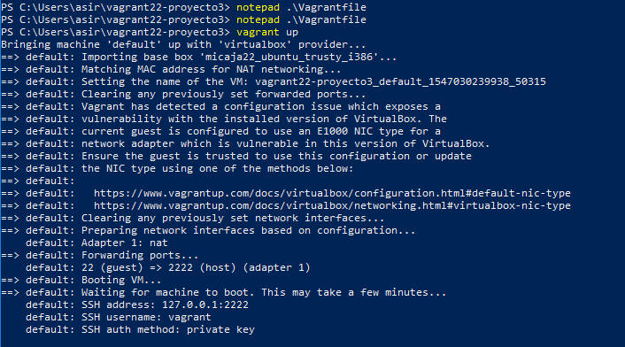

# Vagrant con VirtualBox

## (3.3) Comprobar proyecto 1.

Creación de la máquina, con Vagrant up.

Conexión con la máquna.

## (5.2) Comprobar proyecto 2.

Comprobación de puertos.

Apache2 comprobación.

## (6.1) Suministro Shell Script.

Vagrant up a la máquina.

## (6.2) Suministro Puppet.

Vagrant up a la máquina.

Comprobar instalación de geany que habiamos especificado.

## (7.2) Crear box Vagrant

Crear caja.

Vagrant up, comienza pero tengo los discos llenos y no es posible continuar, doy fé de que esta todo bien y se puede realizar.

